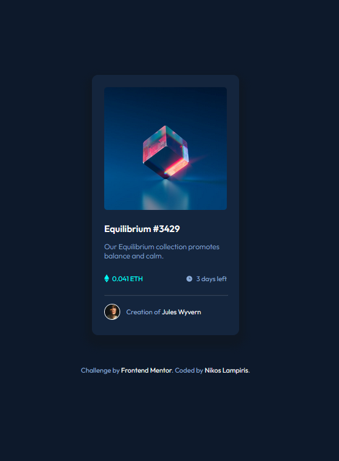

# Frontend Mentor - NFT preview card component solution

This is a solution to the [NFT preview card component challenge on Frontend Mentor](https://www.frontendmentor.io/challenges/nft-preview-card-component-SbdUL_w0U). Frontend Mentor challenges help you improve your coding skills by building realistic projects. 

## Table of contents

- [Frontend Mentor - NFT preview card component solution](#frontend-mentor---nft-preview-card-component-solution)
  - [Table of contents](#table-of-contents)
  - [Overview](#overview)
    - [Screenshot](#screenshot)
    - [Links](#links)
  - [My process](#my-process)
    - [Built with](#built-with)
    - [What I learned](#what-i-learned)
    - [Continued development](#continued-development)
    - [Useful resources](#useful-resources)
  - [Author](#author)

## Overview

### Screenshot

### Links

- Live Site URL: [https://nlabiris.github.io/nft-preview-card-component/](https://nlabiris.github.io/nft-preview-card-component/)

## My process

### Built with

- HTML5
- CSS3
- Flexbox

### What I learned

Handling overlays with 1 or more images.

### Continued development

Learn more about positions and element nesting/relations

### Useful resources

- [Opacity with 2 images (CSS)](https://www.w3docs.com/snippets/css/how-to-overlay-images-with-css.html) - Started as a guide on how to overlay images and play with opacity.

## Author

- Frontend Mentor - [@nlabiris](https://www.frontendmentor.io/profile/nlabiris)